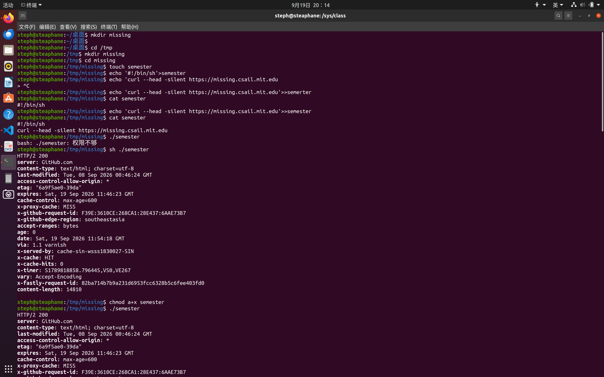
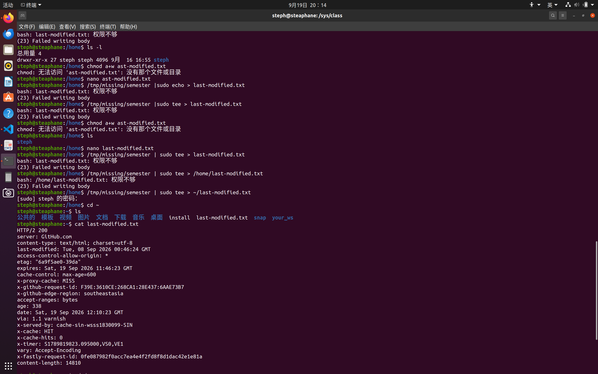
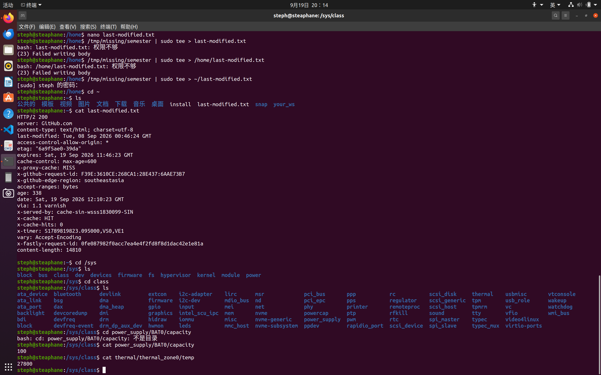

# TASK1的解释文档

1.mkdir为创建文件夹
2.touch指令创建一个空文件
3.通过“echo”和“>”、“>>”把文本输入semester（输入第二行时忘记加上>>所以出错了）
4.用cat查看文件中的内容
5.这里直接./semester提示权限不足 因为touch产生的文件默认只有读写权限没有运行权限 sh semester直接将semester中的内容当作sh的输入 因此实际上没有执行semester 也就不存在没有运行权的问题
6.chmod的作用是改变文件权限 a+x意为对所有适用对象都加上x

1.这里的任务是将semester输出的内容放入一个文件中 但是最开始我误解了题目的意思 原题中的home directory应该指的是home中的steph文件夹 我误解为了/home 而home是属于根目录的 我并没有写入权限 因此一直提示权限不足（我一直尝试sudo tee是因为我在截图之前完整做过一遍任务 当时的我也误解了题目的意思 但是通过某种方法我确实在/home中新建了文档 但是具体指令我忘记了 所以一直在试 直到我将题目发给ai才明白题意）其中|的作用是把前一项的输出作为后一项的输入

1.最后一个任务我用ai提前找到对应的文件位置 然后直接cat
