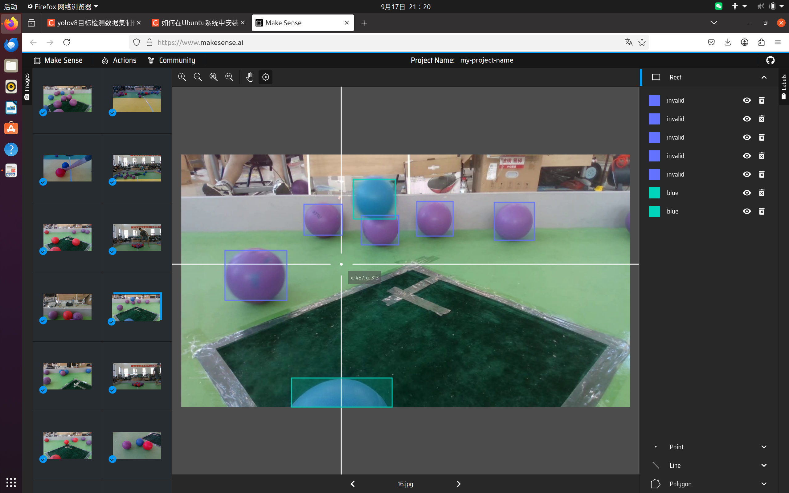
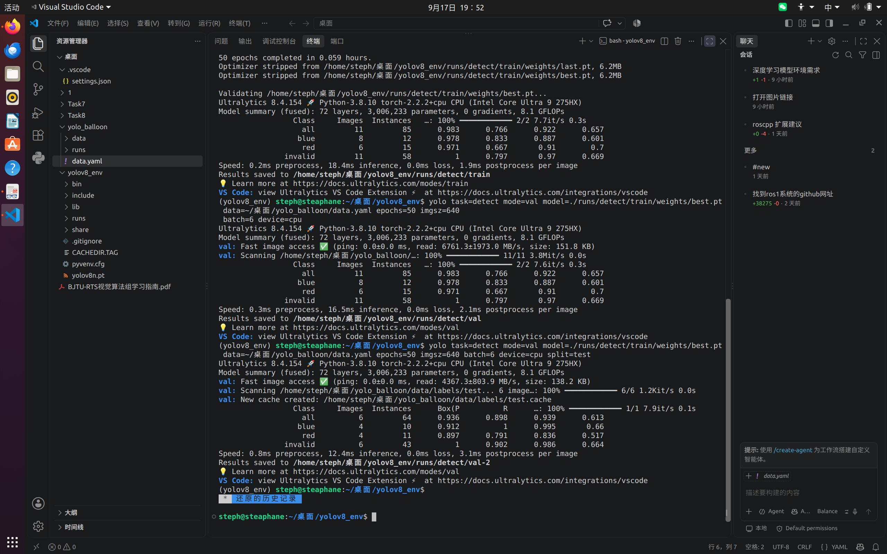

# TASK7
本次任务将数据集分成了三部分test（39）、val（11）、test（6） 首先根据要求对数据集进行标注 标注工具使用的是makesense
（这里没有对invalid进行详细解释 我的理解是invalid是紫色的气球）

之后在data.yaml中写入数据集的地址就可以开始训练大模型了
训练结束后的效果如图
训练结束后得到的模型用开始划分好的test数据集进行检测 识别效果图在 ./识别效果 文件夹中